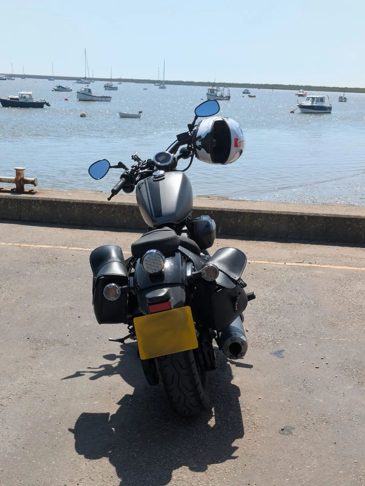

<link href="https://unpkg.com/maplibre-gl@^5.1.0/dist/maplibre-gl.css" rel="stylesheet" />

## Now

<section class="notice">

**LAST UPDATE:** 22/06/26

A [nowpage](https://nownownow.com/about) is like a dotplan, but for the web.

</section>

### Doing

Writing the disseration for my Master's degree.
If you see me around the University of Essex, feel free to say hi!

Decided to have a mild re-work of my site. I want it to have more of
a technical focus, so I archived a lot of old, waffly postings. They're
still available if you know how to look.

### Going

I tend to travel on my motorcycle at weekends.

So far this year, I have visited the places on the map. If you're
really interested, here's the
[📷 Instagram](https://instagram.com/joe_isnt_normal), feel free to
send a follow request.

A visit is when I park my motorcycle and have a drink for reasons
strictly of leisure, so my weekly visits to the University don't
count.

### Using

After a recent
[attack on the Arch User
Repository](https://archlinux.org/news/active-aur-malicious-packages-incident/),
I decided to try another distribution. Sadly, the AUR debacle shows that
the existing security settlement of Linux is no longer adequate and
that containerisation might be the lesser evil.

I'm giving [Bluefin](https://projectbluefin.io/) a try. It's a bit
quirky, it's an immutable root system and as much as possible is
sandboxed. You won't need to use a package manager which writes
to root, instead it's either writing to your user or runs
from a container.

[Distrobox](https://distrobox.it/#distrobox) is pretty good too. I can
see the utility in having a development container separate from your host.
Tip: create a `~/.distrobox` directory and keep your distrobox home directories
in there if you want a properly separate container.

### Reading

A bit late to the party, but [this Encyclical
Letter](https://www.vatican.va/content/leo-xiv/en/encyclicals/documents/20260515-magnifica-humanitas.html)
by the Pontifex is worth reading.
A reminder: the first commandment is "Thou shalt not have any other Gods than
me".

> Humanity, created by God in all its grandeur, is today facing a pivotal
> choice: either to construct a new Tower of Babel or to build the city in which
> God and humanity dwell together.

Banger!
